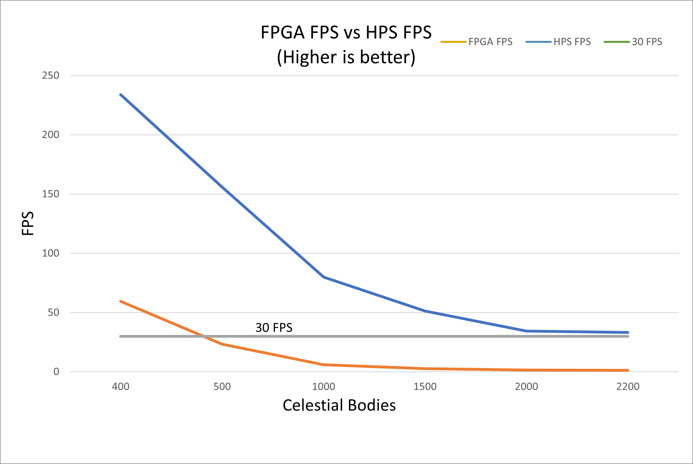

# ECE 5760 Final Project: GravSim, 2D N-body gravity simulator with custom and interactive maps

## Team Members
- Raphael Fortuna
- Tyrone Whitmore-Wilson
- Nicholas George

## Summary

Our goal for this project was to create a gravity simulation and accelerate it using the FPGA. Simulating gravity between celestial bodies (stars, planets, asteroids, etc.) using a standard CPU is limited since it can only do sequential calculations, leading to very long simulation times as the number of bodies increases. Our goal was to speed up these calculations by sending each celestial body’s information to the FPGA, have it calculate each interaction between the other celestial bodies in parallel, and then send the result back up to the ARM to be displayed on the monitor.

    

Our results were that we could simulate almost 5x more celestial bodies at 30 FPS than the HPS could with a maximum of 2200 celestial objects. The accelerator we created outperformed the HPS program that performed the same calculation by at least a factor of 25x, even including communication latency between the FPGA and HPS. 

    

Please see our website, found [here](https://people.ece.cornell.edu/land/courses/ece5760/FinalProjects/s2023/raf269_nkg37_tjw234/raf269_nkg37_tjw234/index.html) for a full description of the project, verilog, and C code.

Here is a link to the demo of our project:
[Video demo link](https://www.youtube.com/watch?v=I-tN022fdpk)

Here is another video with more demos of our project:
[link](https://youtu.be/vNPuH5ApaiQ)

## Installation instructions

The C code run using final_project.c and has the compilation code at the top of final_project.c.

The compiled code requires the StarMaps folder to run. The StarMaps folder contains the maps used in the simulation. The maps are in the form of .csv files and can be edited to create custom maps. Adding more maps can be done in final_project.h by changing
- NUM_MAPS
- mapNames
- map_file_names
- map_num_bodies

with a maximum of 4000 bodies per map. This maximum can be changed by modifying the NUM_BODIES_MAX variable in the final_project.c file.

The format is x location in pixels, y location in pixels, radius in pixels, masses in Earth Masses, x velocity in pixels, and y velocity in pixels.

By default each pixel corresponds with 1 AU (Astronomical Unit). 

The verilog code is also provided and can be flashed to a Altera DE1-SoC Development Kit using Quartus Prime Lite and the GravitySimProjectArchive.qar file.

## How to use

Plug in a VGA screen and a mouse into the FPGA to use the simulator.

The mouse is used to click on the buttons. There are 9 buttons:
- Quit button to exit the simulation
- Pause button to stop the simulation
- Play button to continue the simulation
- Reset button to reset the current map to its initial state
- Speed up button to increase the time step
- Slow down button to decrease the time step
- Clear button to toggle between erasing and not erasing the trails of the celestial bodies
- Map button to cycle through the different maps available in the simulator
- FPGA toggle button to use the HPS or FPGA to simulate the celestial bodies

The mouse can also act as a celestial body and can be activated by clicking right click.

The controls are:
- Left click to increase mass by 20%
- Middle click to decrease mass by 20%
- Right click to exit this mode